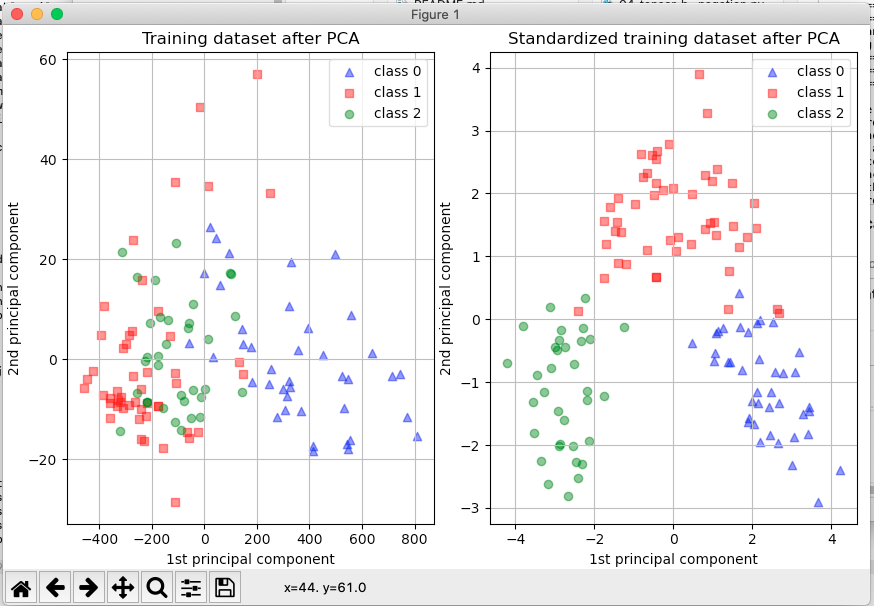

# Introduction to Pytorch
REPO: [pytorch_tut_00](https://github.com/UnacceptableBehaviour/pytorch_tut_00)  
See [References](#references) for links to course content  


## Abstract
Work notes from Introduction to [Pytorch Beginner](https://www.youtube.com/playlist?list=PLqnslRFeH2UrcDBWF5mfPGpqQDSta6VK4).  

## Progress
KEY: (:white_check_mark:) watched, (:mag:) rewatch, (:flashlight:) unseen / to watch, (:question:) problem / open question  
CODE: (:seedling:) code complete, (:cactus:) incomplete / needs work, (:lemon:) not happy / code smells,  

Add table later if relevant.  


## Contents  
1. [Abstract](#abstract)  
2. [Progress](#progress)  
3. [Contents](#contents)  
4. [AIM:](#aim)  
5. [PyTorch Tutorials](#pytorch-tutorials)  
	1. [01 - Installation](#01---installation)  
	2. [02 - Tensor Basics](#02---tensor-basics)  
		1. [**Vid contents - 02 basics**](#vid-contents---02-basics)  
	3. [03 - Gradient Calculation w/ Autograd](#03---gradient-calculation-w-autograd)  
		1. [**Vid contents - 03 gradient calcs**](#vid-contents---03-gradient-calcs)  
	4. [04 - Backpropagation - Theory w/ Example](#04---backpropagation---theory-w-example)  
		1. [**Vid contents - 04 back propagation**](#vid-contents---04-back-propagation)  
	5. [05 - Gradient Descent w/ Autograd and Backpropagation](#05---gradient-descent-w-autograd-and-backpropagation)  
		1. [**Vid contents - 05 logistic regression**](#vid-contents---05-logistic-regression)  
	6. [06 - Training Pipeline: Model, Loss, and Optimizer](#06---training-pipeline-model-loss-and-optimizer)  
		1. [**Vid contents - 06 training pipeline**](#vid-contents---06-training-pipeline)  
		2. [Steps in Torch ML pipeline](#steps-in-torch-ml-pipeline)  
	7. [07 - Linear Regression](#07---linear-regression)  
		1. [**Vid contents - 07 linear regression**](#vid-contents---07-linear-regression)  
		2. [Summary of module import for 07](#summary-of-module-import-for-07)  
		3. [Refs 07](#refs-07)  
			1. [What's the difference between Torch & Pytorch?](#whats-the-difference-between-torch--pytorch)  
			2. [What's THNN?](#whats-thnn)  
	8. [08 - Logistic Regression](#08---logistic-regression)  
		1. [**Vid contents - 08 logistic regression**](#vid-contents---08-logistic-regression)  
		2. [What data sets are available in sklearn?](#what-data-sets-are-available-in-sklearn)  
		3. [torch.tensor.shape() - torch.Size([455, 1])](#torchtensorshape---torchsize455-1)  
	9. [09 - Dataset and DataLoader - Batch Training](#09---dataset-and-dataloader---batch-training)  
		1. [**Vid contents - 09 data loader**](#vid-contents---09-data-loader)  
		2. [Using load_wine() - [sklearn load_wine()](https://scikit-learn.org/stable/modules/generated/sklearn.datasets.load_wine.html#sklearn.datasets.load_wine) to load info about the dataset but doesn't appear to load the whole data set. How do I load & walk the data?](#using-loadwine---sklearn-loadwinehttpsscikit-learnorgstablemodulesgeneratedsklearndatasetsloadwinehtmlsklearndatasetsloadwine-to-load-info-about-the-dataset-but-doesnt-appear-to-load-the-whole-data-set-how-do-i-load--walk-the-data)  
	10. [10 - Dataset Transforms](#10---dataset-transforms)  
		1. [**Vid contents - 10 data transforms**](#vid-contents---10-data-transforms)  
		2. [What is PIL / Pillow?](#what-is-pil--pillow)  
	11. [11 - Softmax and Cross Entropy](#11---softmax-and-cross-entropy)  
		1. [**Vid contents - 11 softmax & X-entropy**](#vid-contents---11-softmax--x-entropy)  
		2. [Sigmoid function](#sigmoid-function)  
		3. [Softmax equation:](#softmax-equation)  
		4. [Refs 11 - softmax & cross entropy](#refs-11---softmax--cross-entropy)  
		5. [Cross-Entropy equation:](#cross-entropy-equation)  
	12. [12 - Activation Functions](#12---activation-functions)  
		1. [**Vid contents - 11 softmax & X-entropy**](#vid-contents---11-softmax--x-entropy)  
		2. [Neural Network code example](#neural-network-code-example)  
		3. [Refs - 12 activation functions](#refs---12-activation-functions)  
	13. [13 - Feed-Forward Neural Network](#13---feed-forward-neural-network)  
		1. [**Vid contents - 09 data loader**](#vid-contents---09-data-loader)  
		2. [**Questions 13**](#questions-13)  
			1. [**What is hidden_size specifying?**](#what-is-hiddensize-specifying)  
		3. [Refs 13 feed forward NN](#refs-13-feed-forward-nn)  
	14. [14 - Convolutional Neural Network (CNN)](#14---convolutional-neural-network-cnn)  
		1. [**Vid contents - 14 CNN**](#vid-contents---14-cnn)  
		2. [CNN pipeline steps](#cnn-pipeline-steps)  
		3. [CNN architecure](#cnn-architecure)  
		4. [CNN pipeline steps - code](#cnn-pipeline-steps---code)  
		5. [Refs 14 - CNNs](#refs-14---cnns)  
	15. [15 - Transfer Learning](#15---transfer-learning)  
		1. [**Vid contents - 09 data loader**](#vid-contents---09-data-loader)  
	16. [16 - How To Use The TensorBoard](#16---how-to-use-the-tensorboard)  
		1. [**Vid contents - 09 data loader**](#vid-contents---09-data-loader)  
	17. [17 - Saving and Loading Models](#17---saving-and-loading-models)  
		1. [**Vid contents - 09 data loader**](#vid-contents---09-data-loader)  
	18. [18 - Create & Deploy A Deep Learning App - PyTorch Model Deployment With Flask & Heroku](#18---create--deploy-a-deep-learning-app---pytorch-model-deployment-with-flask--heroku)  
		1. [**Vid contents - 09 data loader**](#vid-contents---09-data-loader)  
	19. [19 - PyTorch RNN Tutorial - Name Classification Using A Recurrent Neural Net](#19---pytorch-rnn-tutorial---name-classification-using-a-recurrent-neural-net)  
		1. [**Vid contents - 09 data loader**](#vid-contents---09-data-loader)  
	20. [20 - RNN & LSTM & GRU - Recurrent Neural Nets](#20---rnn--lstm--gru---recurrent-neural-nets)  
		1. [**Vid contents - 09 data loader**](#vid-contents---09-data-loader)  
	21. [21 - PyTorch Lightning Tutorial - Lightweight PyTorch Wrapper For ML Researchers](#21---pytorch-lightning-tutorial---lightweight-pytorch-wrapper-for-ml-researchers)  
		1. [**Vid contents - 09 data loader**](#vid-contents---09-data-loader)  
	22. [22 - PyTorch LR Scheduler - Adjust The Learning Rate For Better Results](#22---pytorch-lr-scheduler---adjust-the-learning-rate-for-better-results)  
		1. [**Vid contents - 09 data loader**](#vid-contents---09-data-loader)  
6. [EG chapter---](#eg-chapter---)  
	1. [EG episode](#eg-episode)  
		1. [**Vid contents - EG**](#vid-contents---eg)  
7. [Glossary of terms](#glossary-of-terms)  
8. [How To s](#how-to-s)  
	1. [How to install conda?](#how-to-install-conda)  
		1. [What is conda?](#what-is-conda)  
			1. [TLDR;](#tldr)  
	2. [How to install pytorch on osx?](#how-to-install-pytorch-on-osx)  
	3. [How do I autogenerate README.md file from RTF?](#how-do-i-autogenerate-readmemd-file-from-rtf)  
	4. [Where does conda store virtual environments?](#where-does-conda-store-virtual-environments)  
	5. [What is a conda channel?](#what-is-a-conda-channel)  
	6. [How do I install a conda environment?](#how-do-i-install-a-conda-environment)  
9. [References](#references)  


## AIM:  

Quick look a pytorch - dip toe in water!   


## PyTorch Tutorials  
  
---
### 01 - Installation 
([vid](https://www.youtube.com/playlist?list=PLqnslRFeH2UrcDBWF5mfPGpqQDSta6VK4))  
First install conda (s/w package manger similar to homebrew) [How to install conda](#how-to-install-conda)  
Then creat & activate the virtual environment and install pytorch [How to install pytorch on osx](#how-to-install-pytorch-on-osx)  
  
```
> conda create -n pt3 python=3.7        # -n pt3 - name of the virtual environment can be anything!
> conda activate pt3                    # activate the venv - # To deactivate use $ conda deactivate
> conda install pytorch torchvision torchaudio -c pytorch
```
WARNING: **do NOT set python=3.9** because the instal fails!  
Also  a bit of a gotcha:
```
(base) > conda activate pt3
(pt3) > python --version	             # using SYSTEM version
Python 3.9.2
(pt3) > python3 --version	             # using conda venv version 
Python 3.7.10
> python -c "import sys; print(sys.executable)"  # find out which exe is being used
```
  
Conda [CHEAT SHEET](https://docs.conda.io/projects/conda/en/4.6.0/_downloads/52a95608c49671267e40c689e0bc00ca/conda-cheatsheet.pdf)  
https://github.com/conda/conda/issues/9392  
  
---
### 02 - Tensor Basics  
([vid](https://www.youtube.com/watch?v=exaWOE8jvy8&list=PLqnslRFeH2UrcDBWF5mfPGpqQDSta6VK4&index=2)) - 
([code](https://github.com/UnacceptableBehaviour/pytorch_tut_00/blob/main/scripts/02_tensor_basics.py))  
#### **Vid contents - 02 basics**
 time				| notes	
| - | - |
**0m**		|  Initialisation & types
**3m25**	|  tensor arithamatic
**8m11**	|  manipulations, resize / slice
**10m25**	|  resizing
**10m44**	|  converting from numpy to tensor
**11m50**	|  tensor by refence issues / numpy cpu vs gpu
**14m40**	|  creating tensor on the GPU
**17m**		|  moving to GPU and back to CPU
**17m20**	|  intro to requires_grad argument
  
---
### 03 - Gradient Calculation w/ Autograd  
([vid](https://www.youtube.com/watch?v=DbeIqrwb_dE&list=PLqnslRFeH2UrcDBWF5mfPGpqQDSta6VK4&index=3)) - 
([code](https://github.com/UnacceptableBehaviour/pytorch_tut_00/blob/main/scripts/03_tensor_gradients.py))  
#### **Vid contents - 03 gradient calcs**
 time				| notes	
| - | - |
**0m**		| intro to gradients  
**1m30**	| requires_grad
**1m30**	| computational graph, forward pass, back propagation, 
**5m30**	|  vector Jacobean product. Jacobean matrix w/ derivatives, gradient vector = final gradients (chain rule)   
**8m20**	|  preventing gradient tracking - 3 options
**9m40**	|  option 1 - x.requires_grad_(False)
**10m15**	|  option 2 - x.detach()
**10m40**	|  option 3 - with torch.no_grad():
**11m30**	|  gradient accumulation / clearing
**14m**		|  optimiser
**15m**		|  summary

  
---
### 04 - Backpropagation - Theory w/ Example  
([vid](https://www.youtube.com/watch?v=3Kb0QS6z7WA&list=PLqnslRFeH2UrcDBWF5mfPGpqQDSta6VK4&index=4)) - 
([code](https://github.com/UnacceptableBehaviour/pytorch_tut_00/blob/main/scripts/04_tensor_backpropagation.py))  
#### **Vid contents - 04 back propagation**
 time				| notes	
| - | - |
**0m**		| intro to gradients  
**1m**		|  theory - chain rule
**2m**		|  computational graph
**4m12**	|  backward pass - concept overview
**4m30**	|  linear regression
**4m50**	|  walk through the maths
**10m30**	|  pytorch implementation
  
Chain rule - add reference.  
y hat = predicted loss.  
<p align="center"></p>
  
---
### 05 - Gradient Descent w/ Autograd and Backpropagation  
([vid](https://www.youtube.com/watch?v=E-I2DNVzQLg&list=PLqnslRFeH2UrcDBWF5mfPGpqQDSta6VK4&index=5)) - 
([code - numpy verison](https://github.com/UnacceptableBehaviour/pytorch_tut_00/blob/main/scripts/05_tensor_model_optimisation_a.py)) - 
([code - torch verison](https://github.com/UnacceptableBehaviour/pytorch_tut_00/blob/main/scripts/05_tensor_model_optimisation_b.py))   
#### **Vid contents - 05 logistic regression**
 time				| notes	
| - | - |
**0m**		| Manual, Prediction, Gradient Computation, Loss Computation, Parameter updates
**12m10**	| Switch over from numpy to torch
  
---
### 06 - Training Pipeline: Model, Loss, and Optimizer  
([vid](https://www.youtube.com/watch?v=VVDHU_TWwUg&list=PLqnslRFeH2UrcDBWF5mfPGpqQDSta6VK4&index=6)) - 
([code](https://github.com/UnacceptableBehaviour/pytorch_tut_00/blob/main/scripts/06_tensor_training_pipeline_a.py))  
#### **Vid contents - 06 training pipeline**
 time				| notes	
| - | - |
**0m**		| Steps in Torch ML pipeline
**2m40**	| Step 3 - Adapt code - import torch.nn
**5m04**	| introduce a pytorch model
**11m40**	| custom LinearRegression model

#### Steps in Torch ML pipeline
1) Design Model (input, output size, forward pass)
2) Construct the loss & optimiser
3) Training Loop
  - forward pass: compute prediction
  - backward pass: gradients
  - update weights
  
---
### 07 - Linear Regression  
([vid](https://www.youtube.com/watch?v=YAJ5XBwlN4o&list=PLqnslRFeH2UrcDBWF5mfPGpqQDSta6VK4&index=7)) - 
([code](https://github.com/UnacceptableBehaviour/pytorch_tut_00/blob/main/scripts/07_tensor_linear_regresssion.py))   
#### **Vid contents - 07 linear regression**
 time				| notes	
| - | - |
**0m**		| Review Steps in Torch ML pipeline
**1m**		| imports
**0m**		| review Steps in Torch ML pipeline
**1m**		| library imports
**2m**		| coding starts - prepare data
**4m30**	| 1) Design Model (input, output size, forward pass)
**5m40**	| 2) Construct the loss & optimiser
**7m**		| 3) Training Loop
**10m**		| plot

#### Summary of module import for 07
```
import torch.nn as nn       # PyTorch nn module has high-level APIs to build a neural network.
  # Torch. nn module uses Tensors and Automatic differentiation modules for training and building layers such as input,
  # hidden, and output layers - DOCS: https://pytorch.org/docs/stable/nn.html

import numpy as np      # NumPy is a library for the Python programming language, adding support for large,
  # multi-dimensional arrays and matrices, along with a large collection of high-level mathematical functions to operate
  # on these arrays - DOCS: https://numpy.org/doc/stable/user/whatisnumpy.html

from sklearn import datasets  # to generate a regression dataset
                              # Scikit-learn is a library in Python that provides many unsupervised and supervised
  # learning algorithms. It contains a lot of efficient tools for machine learning and statistical modeling including
  # classification, regression, clustering and dimensionality reduction. Built upon some of the technology you might
  # already be familiar with, like NumPy, pandas, and Matplotlib!
  # DOCS: https://scikit-learn.org/stable/

import matplotlib.pyplot as plt # Matplotlib is a plotting library for the Python programming language. It provides an
  # object-oriented API for embedding plots into applications using general-purpose GUI toolkits like Tkinter,
  # wxPython, Qt, or GTK - DOCS:
  # cheatsheets: https://github.com/matplotlib/cheatsheets#cheatsheets
  # How to plot & save graph hello world: https://github.com/UnacceptableBehaviour/latex_maths#python---matplotlib-numpy
```

Marplotlib & sklearn is not part of the conda virtual environment requires conda install.
```
conda install matplotlib
conda install -c intel scikit-learn		# intel based mac
.
.
Preparing transaction: done
Verifying transaction: done
Executing transaction: \ 
  INSTALLED PACKAGE OF SCIKIT-LEARN CAN BE ACCELERATED USING DAAL4PY. 
  PLEASE SET 'USE_DAAL4PY_SKLEARN' ENVIRONMENT VARIABLE TO 'YES' TO ENABLE THE ACCELERATION. 

  FOR EXAMPLE:
      $ USE_DAAL4PY_SKLEARN=YES python
```


#### Refs 07  
##### What's the difference between Torch & Pytorch?  
Both PyTorch and Torch use [THNN](https://github.com/torch/nn/tree/master/lib/THNN). Torch provides lua wrappers to the THNN library while Pytorch provides Python wrappers for the same.

##### What's THNN?
THNN is a library that gathers nn's C implementations of neural network modules. It's entirely free of Lua dependency and therefore can be used in any application that has a C FFI. Please note that it only contains quite low level functions, and an object oriented C/C++ wrapper will be created soon as another library. (There is also a CUDA counterpart of THNN - THCUNN)

[Static vs Dynamic Shape](https://pgaleone.eu/tensorflow/2018/07/28/understanding-tensorflow-tensors-shape-static-dynamic/) .  
“Describing computational graphs is just a matter of connecting nodes correctly. Connecting nodes seems a trivial operation, **but it hides some difficulties related to the shape of tensors**. This article will guide you through the concept of tensor’s shape in both its variants: static and dynamic.”

How to setup pytorch code prediction for Komodo IDE?
https://www.google.com/search?safe=active&sxsrf=ALeKk03QSxUCcfqoRqniKinMd2nkDpWUuw:1621682572448&q=How+to+setup+%22pytorch%22+code+prediction+for+Komodo+IDE?&sa=X&ved=2ahUKEwi25qytlt3wAhXDTxUIHaTVD7UQ5t4CMAF6BAgDEAo&biw=1125&bih=734
  
---
### 08 - Logistic Regression  
([vid](https://www.youtube.com/watch?v=OGpQxIkR4ao&list=PLqnslRFeH2UrcDBWF5mfPGpqQDSta6VK4&index=8)) - 
([code](https://github.com/UnacceptableBehaviour/pytorch_tut_00/blob/main/scripts/07_tensor_linear_regresssion.py))   
#### **Vid contents - 08 logistic regression**
 time				| notes	
| - | - |
**0m**		| intro
**0m**		| review Steps in Torch ML pipeline
**1m**		| library imports
**2m**		| Prepare data set - Breast Cancer
**7m43**	| Build model
**14m40**	| show accuracy
  
#### What data sets are available in sklearn?  
There are Toy, Realworld & Generated [sklearn datasets here](https://scikit-learn.org/stable/datasets.html).  

#### torch.tensor.shape() - torch.Size([455, 1])
It seems odd that ROWS, COLS would be the order in which to specify shape
```
tensor([[1.],
        [1.],
        [1.],
        [0.],
        .
        .	455 ROWS
        .
        [1.],
        [0.],
        [1.]])

455 - torch.Size([455, 1])

 before y_train 
tensor([1., 1., 1., . . 455 COLS . ., 1., 1., 0., 1., 0., 0., 1., 1., 1., 1., 1.])
455 - torch.Size([455])
```
  
TODO  
Read [this post](https://towardsdatascience.com/understanding-dimensions-in-pytorch-6edf9972d3be) add experimental code.  
More on [dynamic & static shapes](https://pgaleone.eu/tensorflow/2018/07/28/understanding-tensorflow-tensors-shape-static-dynamic/).  
  
---
### 09 - Dataset and DataLoader - Batch Training  
([vid](https://www.youtube.com/watch?v=PXOzkkB5eH0&list=PLqnslRFeH2UrcDBWF5mfPGpqQDSta6VK4&index=9)) - 
([code](https://github.com/UnacceptableBehaviour/pytorch_tut_00/blob/main/scripts/09_tensor_data_loader.py))   
#### **Vid contents - 09 data loader**
 time				| notes	
| - | - |
**0m**		| intro
**0m**		| intro to dataloader classes
**1m30**	| terms: epoch, batch size, num of iteration,
**2m**		| libs: torch, torchvision, torch.utils.data, numpy, math
**2m30**	| Custom datase
**7m13**	| completed class WineDataset(Dataset)
**7m30**	| inspect dataset
**10m18**	| feature vectors & class label ispect
**10m40**	| training loop - iterating dataset
**14m50**	| example data sets: MNIST et al  
  
Terms  
```
epoch = 1 forward & backward pass of all training samples
batch_size = number of training samples in forward & backward pass
number of iterations = number of passes, each pass using [batch_size] number of samples
EG 100 samples, batch_size=20 -> 100/20 = 5 iterations for 1 epoch
```

#### Using load_wine() - [sklearn load_wine()](https://scikit-learn.org/stable/modules/generated/sklearn.datasets.load_wine.html#sklearn.datasets.load_wine) to load info about the dataset but doesn't appear to load the whole data set. How do I load & walk the data?
```
from sklearn.datasets import load_wine
data = load_wine()			# 
```
  
Scaler example [from importance of feature scaling](https://scikit-learn.org/stable/auto_examples/preprocessing/plot_scaling_importance.html#sphx-glr-auto-examples-preprocessing-plot-scaling-importance-py):
  

  
---
### 10 - Dataset Transforms  
([vid](https://www.youtube.com/watch?v=X_QOZEko5uE&list=PLqnslRFeH2UrcDBWF5mfPGpqQDSta6VK4&index=10)) - 
([code](https://github.com/UnacceptableBehaviour/pytorch_tut_00/blob/main/scripts/09_tensor_data_loader.py))   
#### **Vid contents - 10 data transforms**
 time				| notes	
| - | - |
**0m**		| intro to transforms Link: https://pytorch.org/vision/stable/transforms.html
**source**	| https://pytorch.org/vision/stable/_modules/torchvision/transforms/transforms.html
**1m40**	| adapt WineDataset class
**3m40**	| custom transform class
**6m50**	| Mul transform class
**8m50**	| transform list

From: [TORCHVISION.TRANSFORMS](https://pytorch.org/vision/stable/transforms.html)  
**Transforms are common image transformations.** They **can be chained together** using [](https://pytorch.org/vision/stable/transforms.html#torchvision.transforms.Compose). Additionally, there is the [torchvision.transforms.functional](https://pytorch.org/vision/stable/transforms.html#module-torchvision.transforms.functional) module. Functional transforms give fine-grained control over the transformations. This is useful if you have to build a more complex transformation pipeline (e.g. in the case of segmentation tasks).  
  
All transformations accept:   
PIL Image ([Pillow](https://pillow.readthedocs.io/en/stable/installation.html)),  
Tensor Image or  
batch of Tensor Images. 
as input. 
  
**Tensor Image is a tensor with (C, H, W) shape**, where  
C is a number of channels,  
H and W are image height and width.  
  
Batch of Tensor Images is a tensor of (B, C, H, W) shape, where   
B is a number of images in the batch.  
  
Deterministic or random transformations applied on the batch of Tensor Images identically transform all the images of the batch.
Random seed:
```
import torch
torch.manual_seed(17)
```
  
Batch processing  scripts
```
transforms = torch.nn.Sequential(
    transforms.CenterCrop(10),
    transforms.Normalize((0.485, 0.456, 0.406), (0.229, 0.224, 0.225)),
)
scripted_transforms = torch.jit.script(transforms)
```
  
Quick scan of '[https://pytorch.org/vision/stable/transforms.html](https://pytorch.org/vision/stable/transforms.html)' using [fetch_transforms.py](https://github.com/UnacceptableBehaviour/pytorch_tut_00/blob/main/scripts/fetch_transforms.py) give us these transforms:  
```
List scraped with
https://github.com/UnacceptableBehaviour/pytorch_tut_00/blob/main/scripts/fetch_transforms.py

== COMPOSE MULTI TRANSFORM
Compose(transforms)

== ON IMAGES
CenterCrop(size)
ColorJitter(brightness=0, contrast=0, saturation=0, hue=0)
FiveCrop(size)
Grayscale(num_output_channels=1)
Pad(padding, fill=0, padding_mode='constant')
RandomAffine(degrees, translate=None, scale=None, shear=None, interpolation=<InterpolationMode.NEAREST: 'nearest'>, fill=0, fillcolor=None, resample=None)
RandomApply(transforms, p=0.5)
RandomCrop(size, padding=None, pad_if_needed=False, fill=0, padding_mode='constant')
RandomGrayscale(p=0.1)
RandomHorizontalFlip(p=0.5)
RandomPerspective(distortion_scale=0.5, p=0.5, interpolation=<InterpolationMode.BILINEAR: 'bilinear'>, fill=0)
RandomResizedCrop(size, scale=(0.08, 1.0), ratio=(0.75, 1.3333333333333333), interpolation=<InterpolationMode.BILINEAR: 'bilinear'>)
RandomRotation(degrees, interpolation=<InterpolationMode.NEAREST: 'nearest'>, expand=False, center=None, fill=0, resample=None)
RandomSizedCrop(*args, **kwargs)
RandomVerticalFlip(p=0.5)
Resize(size, interpolation=<InterpolationMode.BILINEAR: 'bilinear'>)
Scale(*args, **kwargs)
TenCrop(size, vertical_flip=False)
GaussianBlur(kernel_size, sigma=(0.1, 2.0))
RandomChoice(transforms)
RandomOrder(transforms)

== ON TENSORS
LinearTransformation(transformation_matrix, mean_vector)
Normalize(mean, std, inplace=False)
RandomErasing(p=0.5, scale=(0.02, 0.33), ratio=(0.3, 3.3), value=0, inplace=False)

== CONVERSION
ConvertImageDtype(dtype: torch.dtype) → None
ToPILImage(mode=None)
ToTensor

== GENERIC
Lambda(lambd)

==CUSTOM
ToTensor, MulTransform
```

#### What is PIL / Pillow?  
Python Imaging Library is a free and open-source additional library for the Python programming language that adds support for opening, manipulating, and saving many different image file formats. It is available for Windows, Mac OS X and Linux.   
  
Pillow offers several standard procedures for image manipulation. These include:
 - per-pixel manipulations,  
 - masking and transparency handling,  
 - image filtering, such as blurring, contouring, smoothing, or edge finding,  
 - image enhancing, such as sharpening, adjusting brightness, contrast or color,  
 - adding text to images and much more.   
[Wikipedia](https://en.wikipedia.org/wiki/Python_Imaging_Library).  
```
> conda list                      
pillow                    8.2.0            py37h5270095_0      # shows already installed
> conda install -c anaconda pillow                             # if not in list
```
---
### 11 - Softmax and Cross Entropy  
([vid](https://www.youtube.com/watch?v=7q7E91pHoW4&list=PLqnslRFeH2UrcDBWF5mfPGpqQDSta6VK4&index=12)) - 
([code](https://github.com/UnacceptableBehaviour/pytorch_tut_00/blob/main/scripts/09_tensor_data_loader.py)) - 
([code python \_\_call\_\_](https://github.com/UnacceptableBehaviour/python_koans/blob/master/python3/scratch_pad_1b_instance__call__.py))  
  
#### **Vid contents - 11 softmax & X-entropy**
 time				| notes	
| - | - |
**0m**		| intro
**source**	| https://pytorch.org/vision/stable/_modules/torchvision/transforms/transforms.html
**0m**		| intro softmax maths
**0m30**	| softmax formula
**1m20**	| softmax diagram : scores, logits, probabilities (sum of probabilities = 1), prediction
**1m40**	| code start
**2m**		| softmax: numpy
**2m53**	| softmax: torch
**3m15**	| Cross-Entropy: measures the performance of the output model
note		| better prediction = lower Cross-Entropy loss
**4m05**	| One-Hot encoding: Each class represented by a single binary 1 on classificaton array [0,1,0,0]
**4m30**	| Y hat: predicted probablities (softmax)
**5m17**	| cross_entropy(Y actual, Y hat predicted)
**6m50**	| cross_entropy: torch caveats/gotchas slide
note		| nn.CrossEntropyLoss applies nn.LogSoftmax + nn NLLLoss (-ve log liklihood loss)
note		| Y has class labels not one-hot
note		| Y_pred (y hat) has raw scores (logits), no Softmax
**7m50**	| cross_entropy torch: code
**14m10**	| Neural Net w/ Softmax - slide - multi class
**15m05**	| Neural Net w/ Softmax - code
**16m30**	| Neural Net w/ Sigmoid - slide - binary
**17m10**	| Neural Net w/ Sigmoid - code


#### Sigmoid function
  
Sigmoid function (for any value of x is between 0 & 1, crossover at 0.5) [6m maths](https://www.youtube.com/watch?v=TPqr8t919YM):
<p align="center"></p>
Important thing to note is:
<p align="center"></p>
Used to map output values into probabilities (values between 0 - 1).  

#### Softmax equation:
<p align="center"></p>
What this equation describes is element wise exponentiation divided by the sum of those exponentiations.  
  
   
  
The far right column represent the Sum of exponentiations for each element.   
The preceding 4 the exponentiation of each element.   
Who is divided by the sum to get the softmax probability outputs.   
[desmos - softmax bar charts](https://www.desmos.com/calculator/drqqhtb037) < interactive.   
  
What are logits? Output score from linear layer I think. .
What is an activation function?

#### Refs 11 - softmax & cross entropy
Good visual explanation of how outputs from linear block are converted to probabilities by the softmax block:
[softmax w/ 3d visuals](https://www.youtube.com/watch?v=ytbYRIN0N4g).  

Here Andrew Ng walks through the maths with an example 3m element wise exponentiation
[Andrew Ng- walks through maths example](https://www.youtube.com/watch?v=LLux1SW--oM).  
  
[Sigmoid function](https://www.youtube.com/watch?v=TPqr8t919YM).  


#### Cross-Entropy equation:
Used to home in on a better answer, the lower the cross-entropy loss the closer to target we are.
<p align="center"></p>
TODO - explain the maths
Start w/ single output example, then above is simply a summation for of each of the loss functions for multiple class outputs.  
  
---
### 12 - Activation Functions  
([vid](https://www.youtube.com/watch?v=3t9lZM7SS7k&list=PLqnslRFeH2UrcDBWF5mfPGpqQDSta6VK4&index=13)) - 
([code](https://github.com/UnacceptableBehaviour/pytorch_tut_00/blob/main/scripts/12_tensor_activation_functions.py))   
  
#### **Vid contents - 11 softmax & X-entropy**
 time				| notes	
| - | - |
**0m**		| Intro to activation functions - rationale
**2m**		| Popular activation functions
note 		| Step function, Sigmoid, TanH, ReLU, Leaky ReLU, Softmax
**2m25**	| Sigmoid 0 to 1: Last layer of binary classificatioon problem
**2m50**	| TanH -1 to +1: Scaled & shifted sigmoid function - used in hidden layers
**3m20**	| ReLU: Rectified Linear Unit: 0 for -ve inputs, linear for +ve inputs
 note		| better performance than sigmoid
**4m20**	| Leaky ReLU: Used in solving Vanishing gradient problem
**5m40**	| Softmax:Typically good choice in last layer of a multi classification problem
**6m30**	| Walk the 1st Neural Network code
**7m40**	| Walk the 2nd Neural Network code
**note**		| the NN code isn't executed - next episode
**8m30**	| API: torch.nn, torch.nn.functional


#### Neural Network code example
```
class NeuralNet(nn.Module):
    # initialise models named object vasr with standard functions
    def __init__(self, input_size, hidden_size):
        super(NeuralNet, self).__init__()
        self.linear1 = nn.Linear(input_size, hidden_size)
        self.relu = nn.ReLU()
        self.linear2 = nn.Linear(hidden_size, 1)
        self.sigmoid = nn.Sigmoid()

    # use object name in forward pass
    # output from each step/layer is passed to the next step/layer
    def forward(self, x):
        out = self.linear1(x)
        out = self.relu(out)
        out = self.linear2(out)
        out = self.sigmoid(out)
        return out
```
Is the activation function then a filter that shapes the output to the next layer? Basically yes!
Activation function decides, whether a neuron should be activated or not by calculating weighted sum and further adding bias with it. The purpose of the activation function is to introduce non-linearity into the output of a neuron.  
[Activation functions - wikiP](https://en.wikipedia.org/wiki/Activation_function).  


#### Refs - 12 activation functions
Pytorch Modules [ref here](https://pytorch.org/docs/stable/generated/torch.nn.Module.html).  
Example pipeline [digit identifier](https://pytorch.org/tutorials/beginner/blitz/neural_networks_tutorial.html).  

---
### 13 - Feed-Forward Neural Network  
([vid](https://www.youtube.com/watch?v=oPhxf2fXHkQ&list=PLqnslRFeH2UrcDBWF5mfPGpqQDSta6VK4&index=13)) - 
([code](https://github.com/UnacceptableBehaviour/pytorch_tut_00/blob/main/scripts/13_tensor_feed_froward_NN.py))   
#### **Vid contents - 09 data loader**
 time			| notes	
| - | - |
**0m**			| Overview: MNIST, Dataloader, Transformation, Multilayer NN Activation function, Loss & Optimiser, Training Loop, Model Evaluation, GPU support
**1m30**		| Hyperparameters
**3m15**		| Load data
**6m20**		| Test loading working
**8m40**		| NN class
**10m10**		| Multilayer NN Activation function
**12m**			| Loss & optimizer
**12m40**		| Training loop
**15m**			| Forward pass
**15m50**		| Backwards & Optimize
**17m20**		| Test run


A typical training procedure for a neural network is as follows:
 - Define the neural network that has some learnable parameters (or weights)
 - Iterate over a dataset of inputs
 - Process input through the network
 - Compute the loss (how far is the output from being correct)
 - Propagate gradients back into the network’s parameters
 - Update the weights of the network, typically using a simple update rule: weight = weight - learning_rate * gradient

Viewing loaded MNIST data:
  
  
####**Questions 13**  
#####**What is hidden_size specifying?**  
**What do the Loss & Optimiser steps do? http://cs231n.stanford.edu/slides/2017/cs231n_2017_lecture3.pdf.**  
**Can I use pytorch to clean up images and covert into a data set?**  
[Simple B&W convert](https://www.blog.pythonlibrary.org/2017/10/11/convert-a-photo-to-black-and-white-in-python/) - [thresholding](https://datacarpentry.org/image-processing/07-thresholding/) - Quick bit of hacking to create script to generate 64px wide image from 3Mb mobile image []
**What tools are available to clean up images and covert into a data set?**  

  
#### Refs 13 feed forward NN 
[Pytorch tutorial](https://pytorch.org/tutorials/beginner/blitz/neural_networks_tutorial.html).  
[Torch.NN](https://pytorch.org/docs/stable/nn.html) These are the basic building block for graphs.  
In containers in Torch.nn is Module:  
[Torch.nn.Module](https://pytorch.org/docs/stable/generated/torch.nn.Module.html) Base class for all neural network modules.  
Your models should also subclass this class.  
Modules can also contain other Modules, allowing to nest them in a tree structure. You can assign the submodules as regular attributes.  
[MNIST animation](https://www.youtube.com/watch?v=3JQ3hYko51Y).  
[MNIST Anim - in, weights, in * weight - out vote](https://www.youtube.com/watch?v=DVKMpWnUppA). 
  
---
### 14 - Convolutional Neural Network (CNN)  
([vid](https://www.youtube.com/watch?v=pDdP0TFzsoQ&list=PLqnslRFeH2UrcDBWF5mfPGpqQDSta6VK4&index=14)) - 
([code](https://github.com/UnacceptableBehaviour/pytorch_tut_00/blob/main/scripts/14_tensor_cnn.py))   
#### **Vid contents - 14 CNN**
 time				| notes	
| - | - |
**0m**		| Intro CNN Theory overview
**1m**		| concepts CNN convolutional neural net
**0m12**	| CIFAR-10 dataset - https://en.wikipedia.org/wiki/CIFAR-10
**4m**		| Code start, GPU support, hyper-parameters
**4m40**	| load CIFAR dataset
**5m**		| Quick walk the code see code structure
**7m**		| class definitions in detail
**7m23**	| CNN architecture slide
**11m**		| going over chosen layer parameters
**13m46**	| Calculating the output size > Inputs into Linear layers [more here p52](http://cs231n.stanford.edu/slides/2017/cs231n_2017_lecture5.pdf)
**17m20**	| Class forward method layers
**20m30**	| Run training

Watch this for solid overview on CNN - [03 - MIT 6.S191 - Convolutional Neural Networks](https://www.youtube.com/watch?v=AjtX1N_VT9E) from 14m on.

#### CNN pipeline steps
```
Classification O/P
 |
Softmax layer spread output into a proportional representation
 |
Features Flattened into 1d fully connected layer connects to 2 more layers?
 |
Pooling: (Downsampling, stops overfitting)
Convolution & ReLU
 |
Pooling: (Downsampling, stops overfitting)
Convolution & ReLU
 |
INPUT

## NOTE ##
CONCVOLUTION & ReLU is done on co-located areas to preserve spacial information
POOLING down samples - removes resolution to stop overfitting
these layers are repeated feeding forward into the next layer - FOR FEATURE EXTRACTION
```
  
#### CNN architecure
Here subsampling is the same as downsamplein / pooling I believe.  
  
[Source](http://cs231n.stanford.edu/slides/2017/cs231n_2017_lecture1.pdf).  
[](https://proceedings.neurips.cc/paper/2012/file/c399862d3b9d6b76c8436e924a68c45b-Paper.pdf)
  
The CNN architecture has been developed with changes to width, number of layers, softmax output points all sorts -  [Summary of architectures upto 2015](https://medium.com/analytics-vidhya/cnns-architectures-lenet-alexnet-vgg-googlenet-resnet-and-more-666091488df5).  

[SOURCE -  Krizhevsky-Sutskever-Hinton ](https://arxiv.org/pdf/1905.11946.pdf).  
  
#### CNN pipeline steps - code
```
# 7m - class definitions in detail
# 7m23 - CNN architecture slide
class ConvNet(nn.Module):
    def __init__(self):
        super(ConvNet, self).__init__()
        # Conv2d     https://pytorch.org/docs/stable/generated/torch.nn.Conv2d.html#torch.nn.Conv2d
        # MaxPool2d  https://pytorch.org/docs/stable/generated/torch.nn.MaxPool2d.html#torch.nn.MaxPool2d
        # Linear     https://pytorch.org/docs/stable/generated/torch.nn.Linear.html#torch.nn.Linear
        self.conv1 = nn.Conv2d(3, 6, 5)  # in_channels = 3 (RGB), out_channels = 6?, kernel_size = 5 (5x5)
        self.pool = nn.MaxPool2d(2, 2)
        self.conv2 = nn.Conv2d(6, 16, 5)
        self.fc1 = nn.Linear(16 * 5 * 5, 120)
        self.fc2 = nn.Linear(120, 84)
        self.fc3 = nn.Linear(84, 10)

    def forward(self, x):
        # -> n, 3, 32, 32
        x = self.pool(F.relu(self.conv1(x)))  # -> n, 6, 14, 14
        x = self.pool(F.relu(self.conv2(x)))  # -> n, 16, 5, 5
        x = x.view(-1, 16 * 5 * 5)            # -> n, 400
        x = F.relu(self.fc1(x))               # -> n, 120
        x = F.relu(self.fc2(x))               # -> n, 84
        x = self.fc3(x)                       # -> n, 10
        return x


model = ConvNet().to(device)

criterion = nn.CrossEntropyLoss()
optimizer = torch.optim.SGD(model.parameters(), lr=learning_rate)
```

**Questions**  
**What is CIFAR dataset?**  60K low res images of 'plane', 'car', 'bird', 'cat', 'deer', 'dog', 'frog', 'horse', 'ship', 'truck' - data to learn how to train multi class CNN.  
  
Where does nearest neighbour come into the picture?
  

**How do I visualise extracted features like this?**  
  
This looks promising [visualizing feature maps w/ pytorch](https://debuggercafe.com/visualizing-filters-and-feature-maps-in-convolutional-neural-networks-using-pytorch/)  
  
Can this be improved - try [AlexNet](https://theaisummer.com/cnn-architectures/)

#### Refs 14 - CNNs
CNN history & overview from [The AI Summer](https://theaisummer.com/cnn-architectures/).  


  
---
### 15 - Transfer Learning  
([vid](https://www.youtube.com/watch?v=oPhxf2fXHkQ&list=PLqnslRFeH2UrcDBWF5mfPGpqQDSta6VK4&index=13)) - 
([code](https://github.com/UnacceptableBehaviour/pytorch_tut_00/blob/main/scripts/13_tensor_feed_froward_NN.py))   
#### **Vid contents - 09 data loader**
 time				| notes	
| - | - |
**0m**		| intro
  
**Questions**  
Hmmm but?   
  
  
---
### 16 - How To Use The TensorBoard  
([vid](https://www.youtube.com/watch?v=oPhxf2fXHkQ&list=PLqnslRFeH2UrcDBWF5mfPGpqQDSta6VK4&index=13)) - 
([code](https://github.com/UnacceptableBehaviour/pytorch_tut_00/blob/main/scripts/13_tensor_feed_froward_NN.py))   
#### **Vid contents - 09 data loader**
 time				| notes	
| - | - |
**0m**		| intro
  
---
### 17 - Saving and Loading Models  
([vid](https://www.youtube.com/watch?v=oPhxf2fXHkQ&list=PLqnslRFeH2UrcDBWF5mfPGpqQDSta6VK4&index=13)) - 
([code](https://github.com/UnacceptableBehaviour/pytorch_tut_00/blob/main/scripts/13_tensor_feed_froward_NN.py))   
#### **Vid contents - 09 data loader**
 time				| notes	
| - | - |
**0m**		| intro
  
---
### 18 - Create & Deploy A Deep Learning App - PyTorch Model Deployment With Flask & Heroku  
([vid](https://www.youtube.com/watch?v=oPhxf2fXHkQ&list=PLqnslRFeH2UrcDBWF5mfPGpqQDSta6VK4&index=13)) - 
([code](https://github.com/UnacceptableBehaviour/pytorch_tut_00/blob/main/scripts/13_tensor_feed_froward_NN.py))   
#### **Vid contents - 09 data loader**
 time				| notes	
| - | - |
**0m**		| intro
  
[Docker Introduction 1hr](https://www.youtube.com/watch?v=i7ABlHngi1Q).  
  
---
### 19 - PyTorch RNN Tutorial - Name Classification Using A Recurrent Neural Net  
([vid](https://www.youtube.com/watch?v=oPhxf2fXHkQ&list=PLqnslRFeH2UrcDBWF5mfPGpqQDSta6VK4&index=13)) - 
([code](https://github.com/UnacceptableBehaviour/pytorch_tut_00/blob/main/scripts/13_tensor_feed_froward_NN.py))   
#### **Vid contents - 09 data loader**
 time				| notes	
| - | - |
**0m**		| intro
  
---
### 20 - RNN & LSTM & GRU - Recurrent Neural Nets  
([vid](https://www.youtube.com/watch?v=oPhxf2fXHkQ&list=PLqnslRFeH2UrcDBWF5mfPGpqQDSta6VK4&index=13)) - 
([code](https://github.com/UnacceptableBehaviour/pytorch_tut_00/blob/main/scripts/13_tensor_feed_froward_NN.py))   
#### **Vid contents - 09 data loader**
 time				| notes	
| - | - |
**0m**		| intro
  
---
### 21 - PyTorch Lightning Tutorial - Lightweight PyTorch Wrapper For ML Researchers  
([vid](https://www.youtube.com/watch?v=oPhxf2fXHkQ&list=PLqnslRFeH2UrcDBWF5mfPGpqQDSta6VK4&index=13)) - 
([code](https://github.com/UnacceptableBehaviour/pytorch_tut_00/blob/main/scripts/13_tensor_feed_froward_NN.py))   
#### **Vid contents - 09 data loader**
 time				| notes	
| - | - |
**0m**		| intro
  
---
### 22 - PyTorch LR Scheduler - Adjust The Learning Rate For Better Results  
([vid](https://www.youtube.com/watch?v=oPhxf2fXHkQ&list=PLqnslRFeH2UrcDBWF5mfPGpqQDSta6VK4&index=13)) - 
([code](https://github.com/UnacceptableBehaviour/pytorch_tut_00/blob/main/scripts/13_tensor_feed_froward_NN.py))   
#### **Vid contents - 09 data loader**
 time				| notes	
| - | - |
**0m**		| intro
  


- - - - - - - - - - - - - - - - - - - - - - - - - - - - - - - - - - - - - - - - - - - - - - - - - - - - - - - - - - - - - - - - - - - - - - - - - - - - - - - - - - - - - - - -
## EG chapter---
### EG episode
[vid](https://www.youtube.com/watch?v=HtSuA80QTyo&list=PLUl4u3cNGP61Oq3tWYp6V_F-5jb5L2iHb&index=2&t=423s) ~ 
[lect notes](https://ocw.mit.edu/courses/electrical-engineering-and-computer-science/6-006-introduction-to-algorithms-fall-2011/lecture-videos/MIT6_006F11_lec01.pdf)  

#### **Vid contents - EG**
 time				| notes	
| - | - |
**0m - 15m45**		| into to pytorch
**15m45 - 36m20**	|  installing.  

Maths equation test:
<p align="center"></p>

How to change the maths equation for size?

- - - - - - - - - - - - - - - - - - - - - - - - - - - - - - - - - - - - - - - - - - - - - - - - - - - - - - - - - - - - - - - - - - - - - - - - - - - - - - - - - - - - - - - -
  


## Glossary of terms


Note for array of **any** size tree: element A[n/2+1 . . n] are ALL leaves! 


## How To s
### How to install conda?
DLOAD miniconda installer [from here](https://conda.io/miniconda.html) - used python 3.9 bash.  
```
> shasum -a 256 /Users/simon/Downloads/Miniconda3-py39_4.9.2-MacOSX-x86_64.sh  
b3bf77cbb81ee235ec6858146a2a84d20f8ecdeb614678030c39baacb5acbed1  /Users/simon/Downloads/Miniconda3-py39_4.9.2-MacOSX-x86_64.sh  
SHA256 hash from dload link.  
b3bf77cbb81ee235ec6858146a2a84d20f8ecdeb614678030c39baacb5acbed1.  
Match!  
```
Install:
```
> bash /Users/simon/Downloads/Miniconda3-py39_4.9.2-MacOSX-x86_64.sh
Accept licence
Miniconda3 will now be installed into this location:
/Users/simon/miniconda3
Say yes to initialise, start new shell
> conda --version
conda 4.9.2
> conda update -n base -c defaults conda          # update to latest version
> conda create -n my_virtual_env_name python=3.7  # -n short --name of the virtual environment can be anything!

> conda info --envs	                               # conda environments
# conda environments:
#
base                     /Users/simon/miniconda3
pt3                   *  /Users/simon/miniconda3/envs/pt

> conda remove --name env_name --all              # remove environment

> conda config --set auto_activate_base false     # STOPS conda automatically activating base! WAS ANNOYING
```
[Setting up Virtual environments - basics](https://heartbeat.fritz.ai/creating-python-virtual-environments-with-conda-why-and-how-180ebd02d1db).  
[Conda Environments Python / R - TDS - more in depth](https://towardsdatascience.com/a-guide-to-conda-environments-bc6180fc533).  
  
#### What is conda?  
[Difference between Conda & Pip?](https://www.anaconda.com/blog/understanding-conda-and-pip#:~:text=Pip%20installs%20Python%20packages%20whereas,software%20written%20in%20any%20language.&text=Another%20key%20difference%20between%20the,the%20packages%20installed%20in%20them.)  

##### TLDR;   
Conda more like Homebrew than pip, it's a **cross platform package manager w/ dependency handling.**
[more here](https://towardsdatascience.com/managing-project-specific-environments-with-conda-b8b50aa8be0e) 
inc Conda vs MiniConda vs Anaconda.  
  
Pip is the Python Packaging Authority's recommended tool for installing packages from the Python Package Index, PyPI. Pip installs Python software packaged as wheels or source distributions. The latter may require that the system have compatible compilers, and possibly libraries, installed before invoking pip to succeed.  
  
Conda is a cross platform package and environment manager that installs and manages conda packages from the Anaconda repository as well as from the Anaconda Cloud. Conda packages are binaries. There is never a need to have compilers available to install them. Additionally conda packages are not limited to Python software. They may also contain C or C++ libraries, R packages or any other software.  
  

### How to install pytorch on osx?
[Pytorch Home Page](https://pytorch.org/).  

```
> conda create -n pt3 python=3.7        # -n pt3 - name of the virtual environment can be anything!
> conda activate pt3                    # activate the venv - # To deactivate use $ conda deactivate
> conda install pytorch torchvision torchaudio -c pytorch
```
WARNING: **do NOT set python=3.9** because the instal fails!
  

### How do I autogenerate README.md file from RTF?
Use **create_TOC_for_md.py** which reads a specified RTF file & creates a TOC for the README.md file and the readme itself. 
It will also render & insert latex equations into the readme if needed.  
  
Requires striprtf for TOC function.
An adapted version of render int the same directory as create_TOC_for_md.py for the latex function - [avalable here](https://github.com/UnacceptableBehaviour/algorithms/blob/master/render.py).  
```
                                  # update for conda
> conda activate pt3
> pip install striprtf            # using **pip not RECOMMENDED** investigate options
> curl https://raw.githubusercontent.com/UnacceptableBehaviour/algorithms/master/create_TOC_for_md.py > create_TOC_for_md.py
> chmod +x create_TOC_for_md.py
# to pull render.py - if you need latex
> curl https://raw.githubusercontent.com/UnacceptableBehaviour/algorithms/master/render.py > render.py

# edit create_TOC_for_md.py point DEFAULT_DOC_TO_PROCESS='rtf source file'
> mkdir -p ./scratch/tex          # -p make parent dirs as needed
                                  # add scratch dir to .gitignore - temp work area

> ./create_TOC_for_md.py -p       # to render README.md w/ TOC and maths equations


                                  # IF USING PIP
> .pe                             # alias .pe='. venv/bin/activate'
> pip install striprtf
> copy 
> ./create_TOC_for_md.py -p       # takes MATHS_00_MIT_6.042.rtf course notes and add TOC > README.md
                                  # also add README.md to git, commits, and pushes
                                  # -p = commit & push

> conda list                      # list installed package showing install source (aka channel)
# packages in environment at /Users/simon/miniconda3/envs/pt:
#
# Name                    Version                   Build  Channel
openssl                   1.1.1k               h9ed2024_0  
.  
sqlite                    3.35.4               hce871da_0  
striprtf                  0.0.12                   pypi_0    pypi
etc
```

### Where does conda store virtual environments?
```
# with venv the path to venv is specified like so
> python3 -m venv /path/to/new/environment          
         
With conda they're all in /Users/username/miniconda3/envs    # EG /Users/simon/miniconda3/envs/pt 
                                   Or .../anaconda3/envs
```
You ca also store them in the same way as venv see 
[Defnitive guide to conda](https://towardsdatascience.com/a-guide-to-conda-environments-bc6180fc533)  
see 'I prefer the approach taken by venv for two reasons'.
 
### What is a conda channel?
Conda package sources are called channels, EG default_channels, conda-forge, pypi.  
pypi is a **bad example** since the advice is NOT to install packages in a conda environment using pip.  
You should use ```conda install package```.  

### How do I install a conda environment?
Using a yml config file like so.
```
conda env create -f environment.yml          # as in pip install requirements.txt
                                             # require you to manage dependancies
conda search package_name --info
```

[Defnitive guide to conda](https://towardsdatascience.com/a-guide-to-conda-environments-bc6180fc533)   
[Pip & Conda](https://www.anaconda.com/blog/using-pip-in-a-conda-environment)   
Advice is don't mix them use conda.
If not available on conda option to [build conda packages](https://docs.conda.io/projects/conda-build/en/latest/) is available.
[Understanding Conda & Pip](https://www.anaconda.com/blog/understanding-conda-and-pip)   


- - - - - - - - - - - - - - - - - - - - - - - - - - - - - - - - - - - - - - - - - - - - - - - - - - - - - - - - - - - - - - - - - - - - - - - - - - - - - - - - - - - - - - - -
## References
- - - - - - - - - - - - - - - - - - - - - - - - - - - - - - - - - - - - - - - - - - - - - - - - - - - - - - - - - - - - - - - - - - - - - - - - - - - - - - - - - - - - - - - -
Courses / Books Found w/ Summary:  
[PyTorch Tutorials - Complete Beginner Course](https://www.youtube.com/playlist?list=PLqnslRFeH2UrcDBWF5mfPGpqQDSta6VK4) - 
from [Python Engineer](https://www.youtube.com/c/PythonEngineer).  
[Git-hub-pythorchTutorial](https://github.com/python-engineer/pytorchTutorial).  
  


 